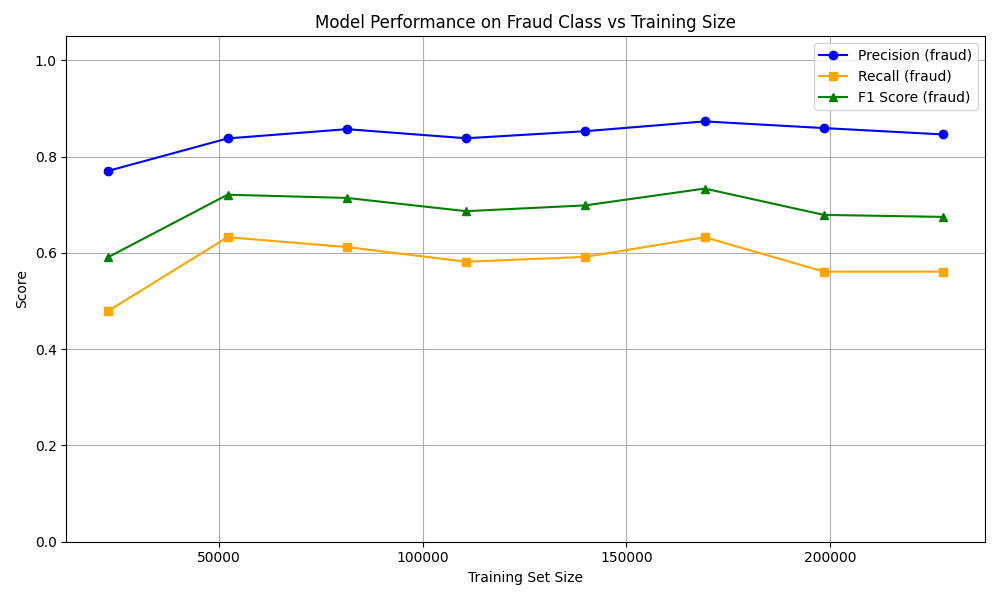

# 💳 Fraud Detection Project

A full-stack credit card fraud detection system that analyzes payment transactions in real time and determines whether they are fraudulent.

---

## 🎯 Purpose

Credit card fraud is a major issue in the financial industry. This project simulates a real-world fraud detection pipeline where:

- A user submits payment details (amount, merchant category, location, time, etc.)
- The backend converts the input into a feature vector that mimics PCA-transformed card transaction data
- A machine learning model predicts the fraud risk score
- A rule engine makes the final approve/reject decision

---

## 🗂️ Project Structure

```
fraud-detection-project/
├── backend/
│   ├── app.py            # FastAPI server with /payment endpoint
│   ├── model.py          # Loads the trained model and runs predictions
│   ├── feature_eng.py    # Converts user input into a 30-dim feature vector
│   ├── rule_engine.py    # Rule-based decision logic (approve / reject)
│   └── train.py          # Model training script
├── data/
│   ├── creditcard.csv    # Dataset (not tracked in git, download separately)
│   └── creditcardfraud.py # Script to download dataset from Kaggle
├── frontend-react/       # React + Vite frontend
├── model/
│   └── logistic.pkl      # Saved trained model
└── requirements.txt
```

---

## 🤖 Model

| Item | Detail |
|---|---|
| Algorithm | Logistic Regression |
| Preprocessing | StandardScaler (feature normalization) |
| Pipeline | `sklearn.pipeline.Pipeline` (scaler + classifier) |
| Dataset | [Kaggle - Credit Card Fraud Detection](https://www.kaggle.com/datasets/mlg-ulb/creditcardfraud) |
| Training split | 80% train / 20% test |
| Performance | Precision 85%, Recall 56% on fraud class |

### Features (30 dimensions)
- `Time` — seconds elapsed since midnight
- `V1` ~ `V28` — PCA-transformed anonymized transaction features (simulated from user input in this project)
- `Amount` — transaction amount

---

## 🚀 How to Run

### 1. Clone the repository

```bash
git clone https://github.com/bobibobab/fraud-detection-project.git
cd fraud-detection-project
```

### 2. Set up Python environment

```bash
python -m venv venv
source venv/bin/activate       # macOS / Linux
# venv\Scripts\activate        # Windows

pip install -r requirements.txt
```

### 3. Download the dataset

```bash
python data/creditcardfraud.py
```

> Requires a Kaggle account. Set up your `~/.kaggle/kaggle.json` API key first.

### 4. Train the model

```bash
python backend/train.py
```

This saves the trained model to `model/logistic.pkl`.

### 5. Start the backend server

```bash
uvicorn backend.app:app --reload
```

The API will be available at `http://127.0.0.1:8000`.

### 6. Start the frontend

```bash
cd frontend-react
npm install
npm run dev
```

The frontend will be available at `http://localhost:5173`.

---

## 🖥️ API Endpoints

### `POST /payment`

Accepts user payment details and returns a fraud risk score.

**Request body:**
```json
{
  "amount": 150.00,
  "merchant_category": "shopping",
  "is_overseas": false,
  "is_new_merchant": false,
  "transaction_time": "14:30"
}
```

**Response:**
```json
{
  "risk_score": 0.0021,
  "decision": "approve"
}
```

`decision` is `"approve"` or `"reject"` based on the risk score and rule engine.

---

## 🛠️ Tech Stack

| Layer | Technology |
|---|---|
| Frontend | React, Vite |
| Backend | FastAPI, Uvicorn |
| ML | scikit-learn (Logistic Regression, StandardScaler) |
| Data | pandas, numpy |
| Model persistence | joblib |

---

## 📊 Model Performance Graph

Since this dataset is highly imbalanced (99.83% normal, 0.17% fraud), **accuracy is not a meaningful metric**.
Instead, we evaluate the model using **Precision**, **Recall**, and **F1 Score** on the fraud class.



### What each metric means:

| Metric | Description |
|---|---|
| 🔵 **Precision** | Of all transactions predicted as fraud, how many were actually fraud |
| 🟠 **Recall** | Of all actual fraud cases, how many the model successfully caught |
| 🟢 **F1 Score** | Harmonic mean of Precision and Recall — overall balance score |

### Current Results:
- **Precision ~85%** → When the model flags a transaction as fraud, it's correct 85% of the time ✅
- **Recall ~56%** → The model catches about half of all actual fraud cases ⚠️
- **F1 Score ~68%** → Overall moderate performance

### Why is Recall low?
The dataset is extremely imbalanced — only 0.17% of transactions are fraud.
This causes the model to miss some fraud cases (False Negatives).
Future improvements could include **SMOTE oversampling** or switching to **XGBoost / RandomForest**.